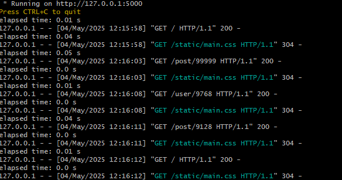
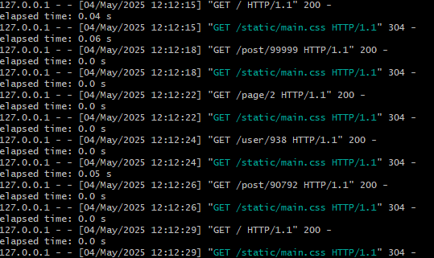
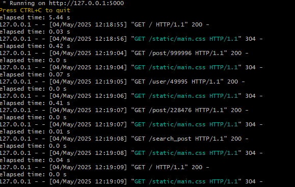
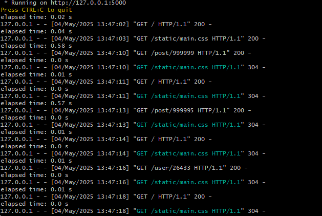

# Elokuvien arvostelu sovellus

## Sovelluksen nykyinen tilanne

* Käyttäjä pystyy luomaan tunnuksen, kirjautumaan sisään, ja kirjautumaan ulos.
* Käyttäjät voivat lisätä, muokata ja poistaa elokuva-arvosteluitaan.
* Jokainen arvostelu sisältää elokuvan nimen, arvostelutekstin, katsomisajan, genret, ja arvosanan (1-5 tähteä).
* Käyttäjä näkee sovellukseen lisätyt arvostelut.
* Käyttäjä pystyy etsimään arvosteluita hakusanalla.
* Sovelluksessa on käyttäjäsivut, jotka näyttävät tilastoja ja käyttäjän lisäämät arvostelut.
* Käyttäjät voivat lisätä elokuvalle genrejä valmiiusta valikosta tai omia genrejä.
* Jättää palautetta muiden arvosteluista valitsemalla peukku ylös/alas ja kirjoittamalla valinnaisen kommentin.

## Sovelluksen asennus

Asenna 'flask'-kirjasto:

'''
$ pip install flask
'''

Luo tietokannan taulut schema.sql avulla:

'''
$ sqlite3 < database.db
'''

Jos haluat esitietoja voit ajaa seed.py ohjelman.

Käynnistä sovellus seuraavalla komennolla:

'''
@ flask run
'''

## Sovelluksen toiminta suurilla tietomäärillä

Sovellusta testattiin suurella tietomäärällä käyttämällä 'seed.py' tiedostoa joka loi tietokantaan 10 000 käyttäjää ja 100 000 arvostelua. Aluksi se hidasti sovelluksen toimintaa etusivulla merkittävästi, koska kaikki arvostelut näytettiin yhdellä sivulla. Kun etusivulle lisättiin sivutus, ongelma ratkesi. Jopa ilman tietokantaindexiä sivun lataamisajat olivat 0.00-0.03s väliltä. 

100 000 käyttäjälle ja 1 000 000 arvostelulla sovellus kaatuu useimmiten etusivua ladatessa, ilman indexiä. Tietokantaindexien käyttöönottamisen jälkeen sivu latautuu noin 6 sekunnissa ja toimii sen jälkeen täydellisesti. Käytössä olivat 'idx_posts_id', 'idx_posts_user_id', ja 'idx_users_id'.

Kuten näemme alla olevista kuvista niin latausajat eivät muuttuneet 10 000 käyttäjällä mutta 100 000 käyttäjällä indexnopeuttivatr latausta huomattavasti.

Ennen indexiä - 10 000 käyttäjää + 100 000 arvostelua:

Indexien jälkeen - 10 000 käyttäjää + 100 000 arvostelua:

Ennen indexiä - 100 000 käyttäjää + 1 000 000 arvostelua:

Indexien jälkeen - 100 000 käyttäjää + 1 000 000:

### Miten sivutus toimii

Kun käyttäjä siirtyy etusivulle vain sivukohtainen määrä arvosteluita haetaan tietokannasta 'LIMIT' ja 'OFFSET' ehtoja käyttämällä Esim sivulla kolme haetaan rivit 21-30.